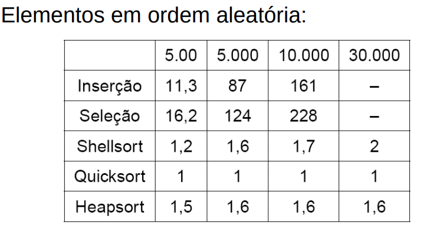
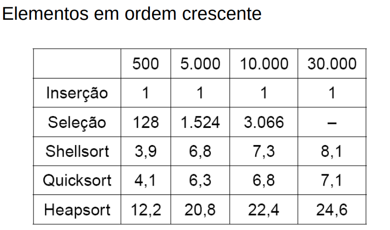
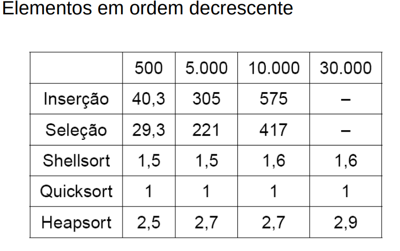

# Conclusao
# Não existe um algoritmo superior a todos e sim um algoritmo que vai ser o melhor em determinará situação, levando em conta os laços e cálculos que serram necessários para obter o melhor algoritmo, Creio que eu o ato de voce conhecer o array que ira ser tratado abre espaço para vários algoritmos diferentes.

# Imagem dos testes
 

# Imagem dos testes
 

# Imagem dos testes
 

# Com esses testes podemos tirar a opinião de qual algoritmo ira ser o melhor em casa situação.
