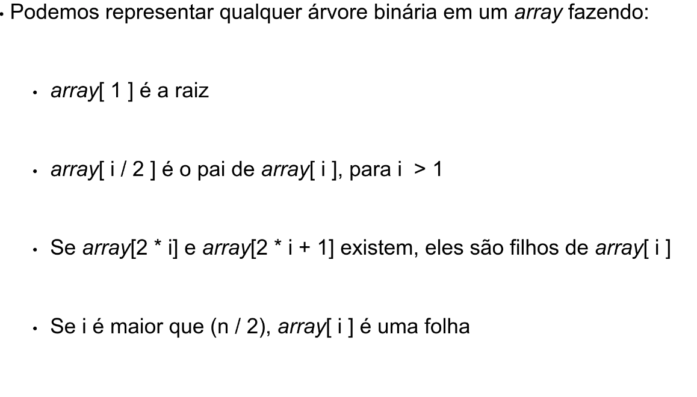
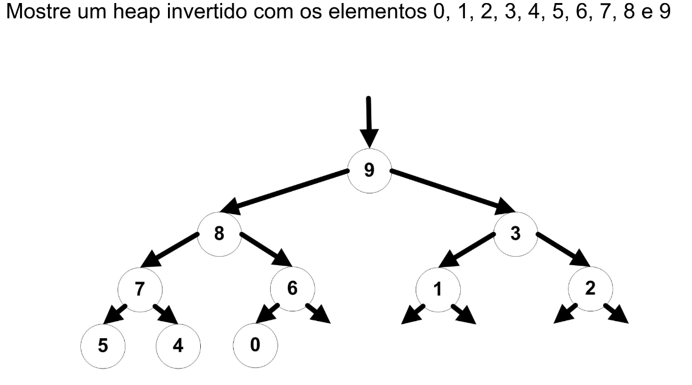

# Heapsort

# O algorítmico Heapsort encontra o maior elemento da lista e com isso troca com o ultimo elemento ate acabar o processo, sua maior diferencia e que ele utiliza de um Heap invertido com o intuito de selecionar o maior elemento de uma forma mais eficiente. Ele se baseia em um heap invertido onde o elemento raiz sera o maior elemento do hep , e seus filhos devem ser menores ou igas
# Basicamente o algorítmico ira funcionar como uma forma de transpor a raiz com o menor de seus filhos e com isso ira parar de utilizar o número que foi trocado com isso ira diminuir a seqüência de execuções.

# Imagem de como ira funcionar nosso codigo
 
[imagem retirada do material de Aed2 , do curso Ciencia da computacao da Praca] 
 

# Imagem intuitiva de como ira ficar nosso Heap invertido
 
[imagem retirada do material de Aed2 , do curso Ciencia da computacao da Praca] 
 

# Contras
. Complexidade de intendimento 
. inversões no codigo 
. Estável

# Complexidade
. Melhor caso ::"  "  
. Caso médio :: "  " 
. Pior casos :: Todos os casos sao iguais

# Ω = Melhor caso
# Θ = Caso medio
# O = Pior caso

# Notacao        Ω(n*log(n))  Θ(n*log(n))  O(n*log(n))
